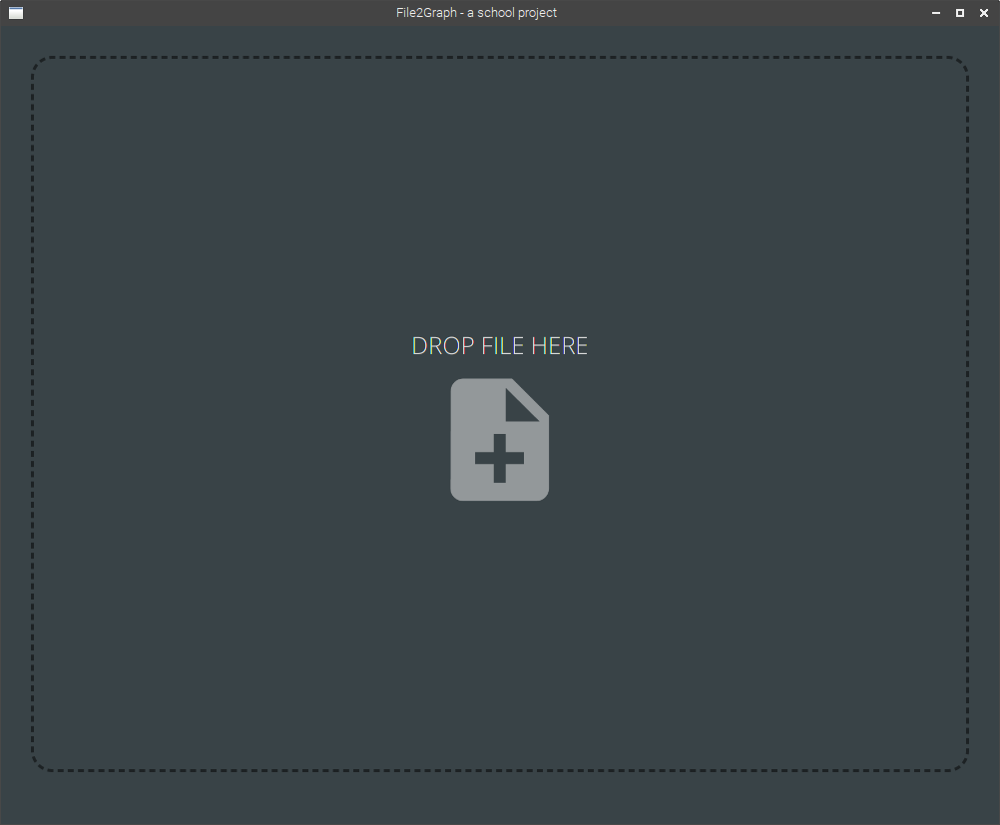
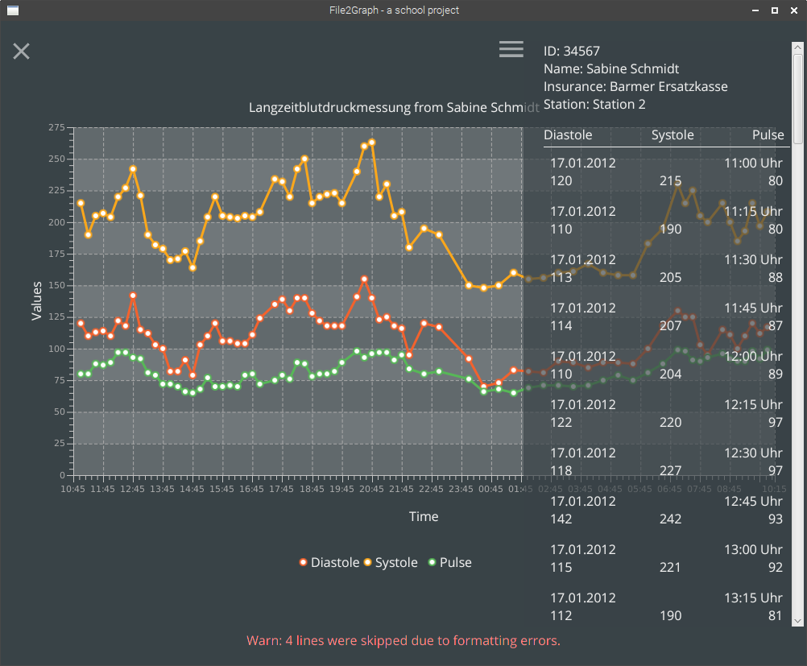

# file2chart-school

This app was created in the context of a homework for my last year of high-school on a medicine/informatics centered school. It takes files (with a specific format) via drag'n'drop and plots their data in a chart.

It is based on the same, self-made view managing system I made for a different school project. 

## Parsing the file

Files are allways constructed like this:

    Art: <examination type>
    Patient/in: PID |<HL7 Patient data>
    Datum     Uhrzeit     Systole     Diastole    Puls
    <<repeating measurements>>
    <date>    <time>      <systole>   <diastole>  <puls>
    <</repeating>>

The data is read into a nested data structure:

                   [Examination]
                <list>  masurements
                <Patient>   patient
                <String>       type
                
                 /               \
                /                 \
               /                   \
               
          [Patient]            [Measurement]
      <String>     FName      <String>   date
      <String>     LName      <String>   time
      <String>        ID      <Long> unixTime
      <String> Insurance      <int>  diastole
      <String>   station      <int>   systole
                              <int>     pulse

   
   The reader returns a `readerResult` object. Here are the most important methods:
   
    - `boolean: success()` true when the file was successful read
    - `String: getError()` returns a human readable error message (or `null`)
    - `Examination: getResult()` returns the read examination
    - `int: getLinesSkipped()` returns the number of lines that were skipped due to parsing errors
    - `int: getLinesRead()` return the number of successfully read **measurements**
 
 
## UI
 
When starting up, you are greeted by a dark "drop file here" field, which is also clickable for an "open file" dialog:

Upon submitting a file, the View changes to a large graph:

On the top right is a hamburger icon which extends the side-nav which contains all the other details.

The "X" on the top left get's you back to the drop page.

## Maybe-features / development possibilities

 - Details in the graph when hovering over points
 - Better resizeablility
 - A persistent error log
 - Viewing multiple files / file history
 - General persistency for patients etc... Would need a database... So probably not gonna happen
 
